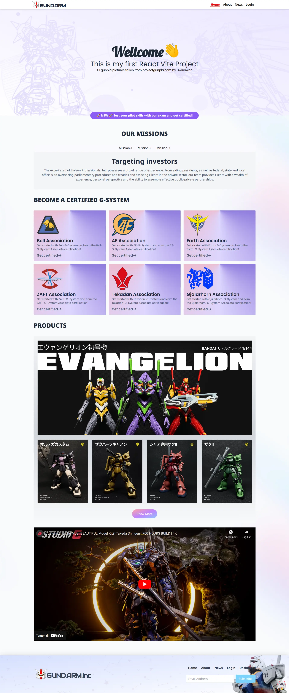
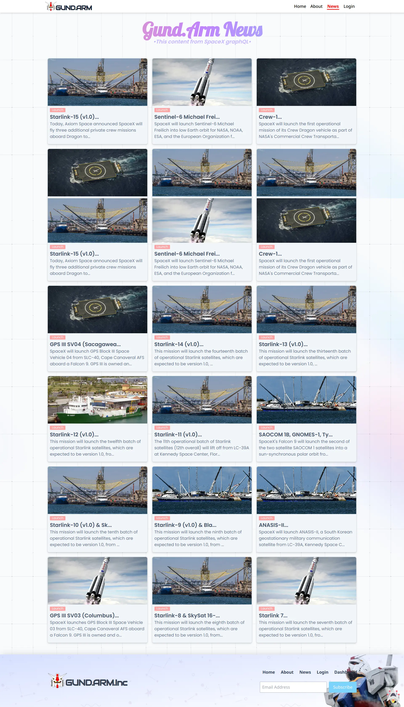
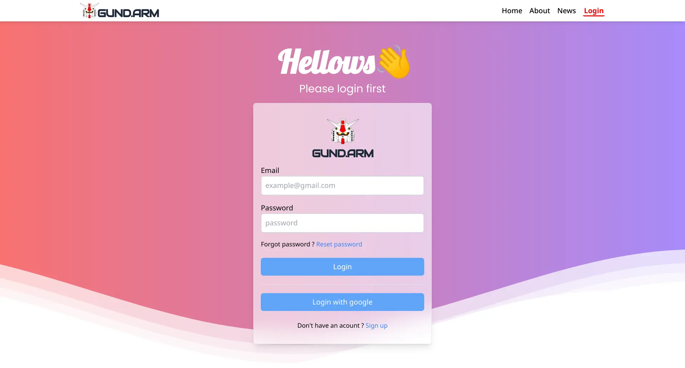
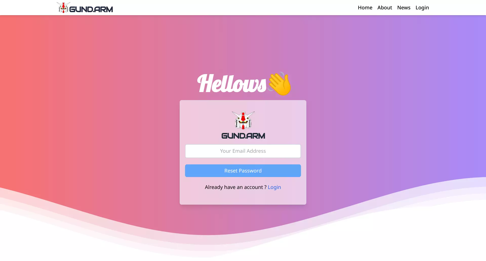
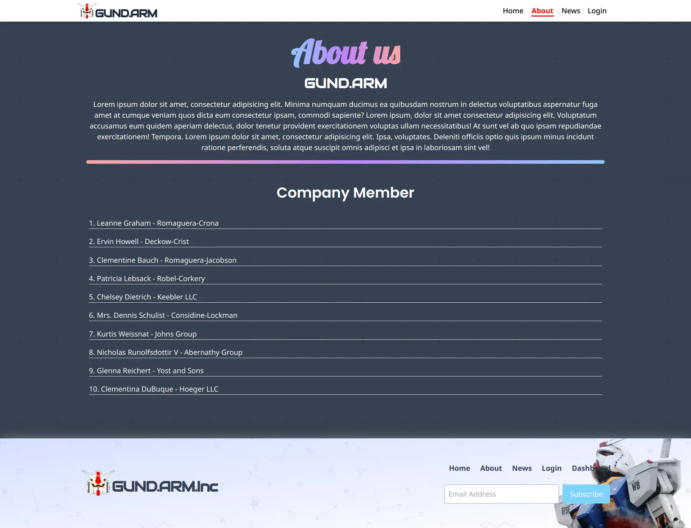
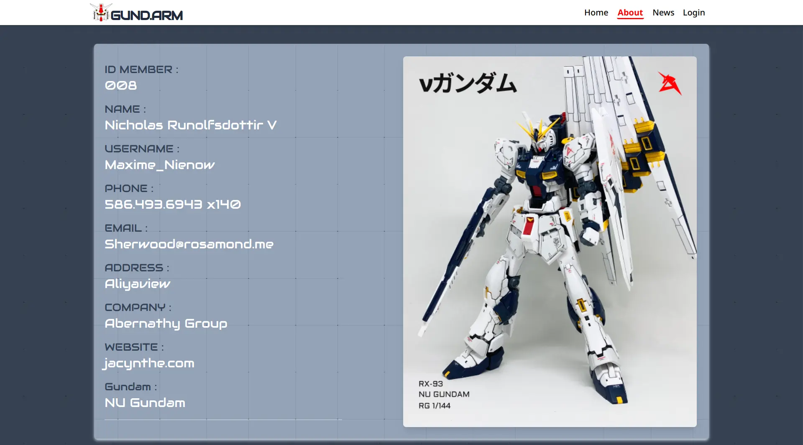

<div align="center">

<!-- PROJECT LOGO -->

# GUND.ARM.Inc


</div>

> GUND.ARM is a Gundam themed company profile website built using several technologies such as Vit, React JS, Tailwind CSS, Firebase Authentication and others

## ✨ Demo

Here is a working live demo : [Demo](https://gund-arm.web.app/)

<!-- ## 🎥 Video Demo -->

## 🔮 Features

- Sign up, sign in, reset password and sign out with Firebase Authentication.
- Fetch data from jsonplaceholder API with axios.
- Fetch data from SpaceX GraphQL API with apollo clinet.
- Responsive Website.

## 🧰 Run in locale

To clone and run this website, you'll need [Git](https://git-scm.com) and [Node.js](https://nodejs.org/en/download/) (which comes with [yarn](https://yarnpkg.com/) installed on your computer. From your command line:

```bash
# Clone this repository
$ git clone https://github.com/rizalyoga/gund-arm-company-profile.git

# Go into the repository
$ cd gund-arm-company-profile

# Install dependencies
$ yarn

# Run the app
$ yarn dev

```

## ⛏️ Built With

- [Vite](https://vitejs.dev/)
- [React JS](https://reactjs.org/)
- [React Router Dom](https://reactrouter.com/)
- [Tailwind css](https://tailwindcss.com/)
- [Axios](https://github.com/axios/axios)
- [Apollo Client](https://www.apollographql.com/)
- [Firebase](https://firebase.google.com/)
- [SpaceX API](https://api.spacex.land/graphql/)
- [Jsonplaceholder API](https://jsonplaceholder.typicode.com/)
- [react-lazy-load-image-component](https://www.npmjs.com/package/react-lazy-load-image-component)

## 👤 Authors

- [Rizalyoga](https://github.com/rizalyoga/)

## 📝 Notes

> All gunpla pictures taken from projectgunpla.com by Dwinawan

## 🖼️ UI Preview

|            Landing Page             |               News Page               |
| :---------------------------------: | :-----------------------------------: |
|   |     |
|         <b> Login Page</b>          |      <b>Reset Password Page</b>       |
|  |       |
|       <b> About Us Page </b>        |     <b> Details Member Page </b>      |
|  |  |

<!-- ## 🙊 Environment Variables

To run this project, you will need to add the following environment variables to your .env file

`REACT_APP_API_URL`

That contains the endpoint for the backend -->
